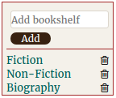
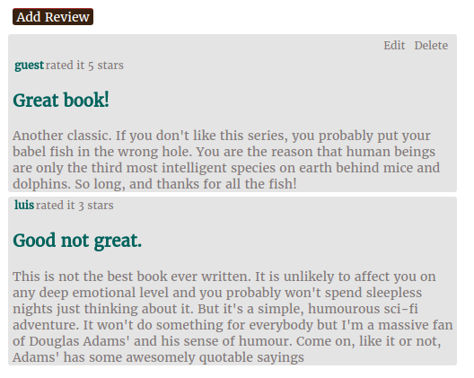
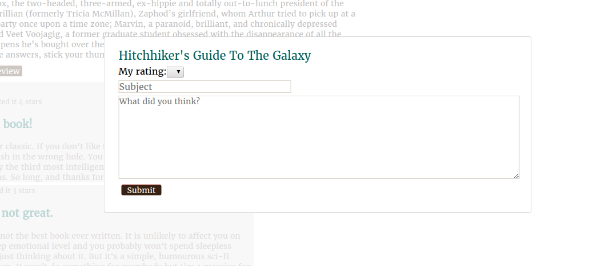

# okayreads

[okayreads live][heroku]

[heroku]: https://okayreads-.herokuapp.com/

Okayreads is a web application based on Goodreads. It is a complete full-stack project. It utilizes PostgreSQL for it's database. The backened is handled with Ruby on Rails while the frontend uses React/Redux libraries.

## Features and Implementation

### Bookshelves
For this feature I implemented two tables: one that holds the bookshelves and another one that holds the books that each of those bookshelves contains. These bookshelves table is linked to a user by a `user_id` column. The ones that holds the books for each bookshelf links both a book and a bookshelf by `book_id` and `bookshelf_id`.

I used two components to deal with the Bookshelves. The `BookshelfIndex` holds all the bookshelves for the current user and a form to add new ones. When you click on a bookshelf it takes you to the `BookshelfShow` component which holds all the books that belong to it.



### Reviews
This feature uses a `Review` table that stores the reviews created by users for a particular book. Review entries have the columns: `user_id`, `book_id`, `title`, `body` and `score`.

The main review component is `ReviewIndex`. This component renders a list of reviews by way of the `ReviewIndexItem` component.

This is the code to iterate over every review and render them:

```javascript
render(){
  const reviews = this.props.reviews.map((review) => {

    if (this.props.bookReviewIds.includes(review.id)) {
      return (
        <ReviewIndexItemContainer key={review.id} review={review}/>
      );
    }
  });

  return (
    <div className="review-index-main-div">
      <div className="review-index-main-div-link">
        <CreateReviewFormContainer />
      </div>
      {reviews}
    </div>
  );
}
```



You can also create and edit reviews. Each of these was implemented using the `React Modal` library. This library allows to create a modal without any hassle.



## Future Implementations

To further my project I plan to add more features to it.

### User admin pages

This feature will allow to have administrative users. These users will be able to change website configurations along with uploading new books through the frontend.

### Tags

Books will be able to have tags, that users can then use to search books by.
